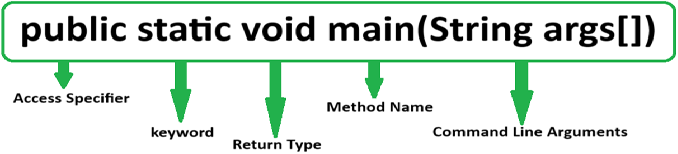

# Java Interview Questions & Answers

### Table of Contents

| Questions                                                                                           |
| --------------------------------------------------------------------------------------------------- |
| [What is Java (Just Another Virtual Accelerator)](#what-is-Java)                                    |
| [Feature of java](#Feature-of-java)                                                                 |
| [Feature of Java 20](#Feature-of-Java-20)                                                           |
| [Feature of Java 8](#Feature-of-Java-8)                                                             |
| [What is Platform](#What-is-Platform)                                                               |
| [What is Platform Independence](#What-is-Platform-Independence)                                     |
| [Why java is independent](#Why-java-is-independent)                                                 |
| [Why we use static in Main Method in java](#Why-we-use-static-in-Main-Method-in-java)               |
| [Why main method is static](#Why-main-method-is-static)                                             |
| [Why we use void in Main Method in java](#Why-we-use-void-in-Main-Method-in-java)                   |
| [Why we use public in Main Method in java](#Why-we-use-public-in-Main-Method-in-java)               |
| [Why we use String args[] in Main Method in java](#Why-we-use-String-args[]-in-Main-Method-in-java) |
|                                                                                                |
| [What is serialization](#What-is-serialization)                                                     |
| [What is deserialization](#What-is-deserialization)                                                 |
| [What is Access Specifiers in Java](#What-is-Access-Specifiers-in-Java)                             |
|                                                                                                |
|                                                                                                |
|                                                                                                |
|                                                                                                |
|                                                                                                |
|                                                                                                |
|                                                                                                |
|                                                                                                |
|                                                                                                |
|                                                                                                |
|                                                                                                |
|                                                                                                |
|                                                                                                |
|                                                                                                |
|                                                                                                |

  ---

### What is Java (Just Another Virtual Accelerator)

  Java is a high level, class based, object-oriented programming language that is designed to have as few implementation dependencies as possible. Java is widely used programming language for coding web application.

  **[⬆ Back to Top](#table-of-contents)**

  ---

### Feature of java

  Java 20 provides following features for Java Programming: 01. Simple 02. Object-Oriented 03. Portable 04. Platform independent 05. Secured 06. Robust 07. Architecture neutral 08. Interpreted 09. High Performance 10. Multithreaded 11. Distributed 12. Dynamic

  **[⬆ Back to Top](#table-of-contents)**

  ---

### Feature of Java 20

  Java 20 provides following features for Java Programming:

  1.  Virtual Threads
  2.  Vector API Proposal
  3.  Structured Concurrency
  4.  Scoped Values
  5.  Foreign Function and Memory (FFM) API
  6.  Record Patterns
  7.  Pattern Matching for Switch Statement and Expressions

  **[⬆ Back to Top](#table-of-contents)**

  ---

### Feature of Java 8

  Java 8 provides following features for Java Programming:

  1.  Lambda expressions,
  2.  Method references,
  3.  Functional interfaces,
  4.  Stream API,
  5.  Default methods,
  6.  Base64 Encode Decode,
  7.  Static methods in interface,
  8.  Optional class,
  9.  Collectors class,
  10. ForEach() method,
  11. Nashorn JavaScript Engine,
  12. Parallel Array Sorting,
  13. Type and Repeating Annotations,
  14. IO Enhancements,
  15. Concurrency Enhancements,
  16. JDBC Enhancements etc.

  **[⬆ Back to Top](#table-of-contents)**

  ---

### What is Platform

  Combination of Hardware and Software. Example :- i5 is a processor and Window is an OS. This is Platform.

  **[⬆ Back to Top](#table-of-contents)**

  ---

### What is Platform Independence

  Java designed its own complier called Java Compiler which converts HLL into byte code. This byte code is given to Java Virtual Machine (JVM) which convert it to MLL.

  **[⬆ Back to Top](#table-of-contents)**

  ---

### Why java is independent 

  Java is considered platform-independent due to its "write once, run anywhere" principle. Java programs are compiled into bytecode that can be executed on any platform with a Java Virtual Machine (JVM). This enables developers to write code once and deploy it on various operating systems, making it independent of specific hardware or software configurations.

  **[⬆ Back to Top](#table-of-contents)**

  ---

### Why we use static in Main Method in java

  The `static` keyword is used in the `main` method in Java for a few important reasons.
  Firstly, it allows the `main` method to be access directly by the Java Virtual Machine (JVM) without requiring an instance of the class.
  Secondly, it follows the convention set by Java for the entry point of a program, enabling the JVM to identify and execute it properly.

  **[⬆ Back to Top](#table-of-contents)**

  ---

### Why main method is static

  The `main` method in Java is declared as `static` because it needs to be accessed by the Java Virtual Machine (JVM) without creating an instance of the class. This allows the JVM to execute the program without requiring an object to be created first, making it the entry point for the application.

  **[⬆ Back to Top](#table-of-contents)**

  ---

### Why we use void in Main Method in java

  In Java, we use the `void` keyword in the `main` method to indicate that the method does not return any value. The `main` method is meant to initiate the program's execution and does not need to return any specific result or value.

  **[⬆ Back to Top](#table-of-contents)**

  ---

### Why we use public in Main Method in java

  We use the `public` access modifier in the `main` method in Java to allow the JVM to access and invoke it as the entry point for the program, ensuring its visibility and execution from outside the class.

  **[⬆ Back to Top](#table-of-contents)**

  ---

### Why we use String args[] in Main Method in java

  In the `main` method of Java, `String args[]` is used to accept command-line arguments passed to the program. It allows the program to receive inputs or parameters from the command line and process them within the program's execution.

  **[⬆ Back to Top](#table-of-contents)**

  ---

### What is command line argument

  Command-line arguments are values that are passed to a Java program when it is run from the command line or terminal. These arguments allow you to provide input or configuration options to your Java application without having to modify the source code.

  

  
  **[⬆ Back to Top](#table-of-contents)**

  ---

### What is serialization

  Serialization is a mechanism of converting the state of an object into a byte stream.

  **[⬆ Back to Top](#table-of-contents)**

  ---

### What is deserialization

  Deserialization is the reverse process where the byte stream is used to recreate the actual Java object in memory.

  **[⬆ Back to Top](#table-of-contents)**

  ---

### What is Access Specifiers in Java?

  In Java, access specifiers are used to specify the access level of a class or its members (data and methods). There are four access specifiers in Java:

  **1. public**: When we declare class members as public, they are accessible from outside the class.
  **2. private:** When we declare class members as private, they are only accessible within the class and are not accessible from outside the class.
  **3. default:** When we declare class members with no access specifier is considered as default, they are only accessible within the package and are not accessible from outside the package.
  **4. protected:** When we declare class members as protected, they are only accessible by any class within the same package or by any subclasses of the parent class in which the class members are declared as protected, regardless of whether the subclass is in the same package or a different package.

  **Note:** A package is a container that contains classes in java.

  **[⬆ Back to Top](#table-of-contents)**

  ---

### 
  **[⬆ Back to Top](#table-of-contents)**
  ---
  **[⬆ Back to Top](#table-of-contents)**
  ---

## Disclaimer

The questions provided in this repository are the summary of frequently asked questions across numerous companies. We cannot guarantee that these questions will actually be asked during your interview process, nor should you focus on memorizing all of them. The primary purpose is for you to get a sense of what some companies might ask — do not get discouraged if you don't know the answer to all of them ⁠— that is ok!

Good luck with your interview 😊

---
